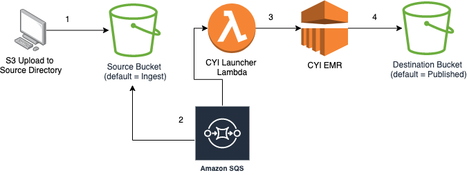

# aws-cyi-infrastructure

## High level architecture



1. Data is uploaded to the S3 bucket in AWS under the prefix `{DATABASE_NAME}/{YYYY-MM-DD}/`
1. An SQS queue triggers an EMR launcher lambda based on an upload to this location
1. The [Launcher Lambda](https://github.com/dwp/emr-launcher) spins up an EMR based on the desired configs defined in the Terraform in this repo
1. One of the steps added to the EMR cluster makes a temporary table over the data in S3, partitions the data to match the schema of the larger table then appends the data to the larger table within the destination S3 bucket.

#### [A more detailed explaination can be found here](https://git.ucd.gpn.gov.uk/dip/aws-common-infrastructure/wiki/DataWorks-AWS-Data-Products#cyi)

## A repository for building the CYI specific EMR cluster in AWS and ingesting data into hive

This repo contains Makefile and base terraform folders and jinja2 files to fit the standard pattern.

Running aviator will create the pipeline required on the AWS-Concourse instance, in order pass a mandatory CI ran status check. This will likely require you to login to Concourse, if you haven't already.

After cloning this repo, please generate `terraform.tf` and `terraform.tfvars` files:  
`make bootstrap`

In addition, you may want to do the following: 

1. Create non-default Terraform workspaces as and if required:  
    `make terraform-workspace-new workspace=<workspace_name>` e.g.  
    ```make terraform-workspace-new workspace=qa```

1. Configure Concourse CI pipeline:
    1. Add/remove jobs in `./ci/jobs` as required 
    1. Create CI pipeline:  
`aviator`

## Concourse pipeline

There is a concourse pipeline for aws-cyi-infrastructure named `aws-cyi-infrastructure`. The code for this pipeline is in the `ci` folder. The main part of the pipeline (the `master` group) deploys the infrastructure and runs the e2e tests. There are a number of groups for rotating passwords and there are also admin groups for each environment.

### Admin jobs

Any jobs that require the use of aviator, e.g. starting and stopping clusters need to be added to the [dataworks-admin-utils repository](https://github.com/dwp/dataworks-admin-utils). The existing jobs can be [seen here](https://ci.dataworks.dwp.gov.uk/teams/utility/pipelines/cyi-emr-admin)

#### Start cluster

This job will start an aws-cyi-infrastructure cluster. In order to make the cluster do what you want it to do, you can alter the following environment variables in the pipeline config (in [the above repo](#admin-jobs)) and then run `aviator` to update the pipeline before kicking it off:

1. EXPORT_DATE (required) -> the date the data was exported, i.e `2021-04-01`
1. CORRELATION_ID (required) -> the correlation id for this run, i.e. `<some_unique_correlation_id>`
1. START_DATE (optional) -> a date in the same form as above (`YYYY-MM-DD`) from which to start a historical data load. Data will be loaded from this date until the `EXPORT-DATE`

*N.B.* The S3_PREFIX argument is also required, though it is not used by the step.

#### Stop clusters

For stopping clusters, you can run the `stop-cluster` job (in [the above repo](#admin-jobs)) to terminate ALL current `aws-cyi-infrastructure` clusters in the environment.

### Clear dynamo row (i.e. for a cluster restart)   

Sometimes the aws-cyi-infrastructure cluster is required to restart from the beginning instead of restarting from the failure point.
To be able to do a full cluster restart, delete the associated DynamoDB row if it exists. The keys to the row are `Correlation_Id` and `DataProduct` in the DynamoDB table storing cluster state information (see [Retries](#retries)).   
The `clear-dynamodb-row` job is responsible for carrying out the row deletion.

To do a full cluster restart

* Manually enter CORRELATION_ID and DATA_PRODUCT of the row to delete to the `clear-dynamodb-row` job (in [the above repo](#admin-jobs)) and run aviator.


    jobs:
      - name: dev-clear-dynamodb-row
        plan:
          - .: (( inject meta.plan.clear-dynamodb-row ))
            config:
              params:
                AWS_ROLE_ARN: arn:aws:iam::((aws_account.development)):role/ci
                AWS_ACC: ((aws_account.development))
                CORRELATION_ID: <Correlation_Id of the row to delete>
                DATA_PRODUCT: <DataProduct of the row to delete>

* Run the admin job to `<env>-clear-dynamodb-row`

* You can then [run `start-cluster` job](#start-cluster) with the same `Correlation_Id` from fresh.
